# Hybrid Azure Site-to-Site VPN Lab with FortiGate

A hands-on hybrid networking project that connects an on-premises FortiGate 60D environment to Microsoft Azure using a route-based IPsec Site-to-Site VPN.

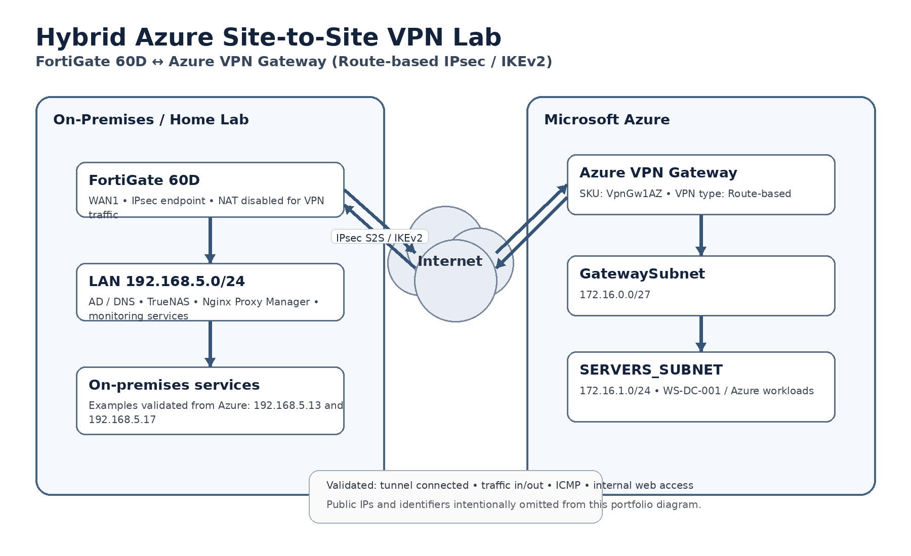
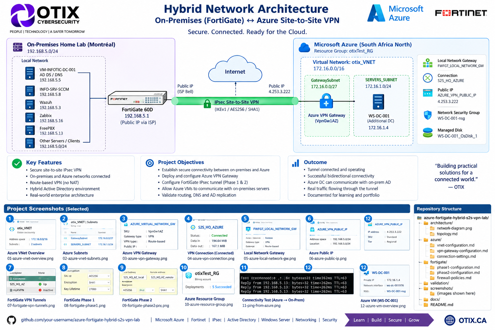
## Project goals

- Build secure connectivity between an on-premises network and an Azure VNet.
- Configure Azure VPN Gateway, Local Network Gateway, and the S2S connection.
- Configure matching IPsec settings on FortiGate.
- Validate bidirectional reachability and application access across the tunnel.
- Document the deployment as a portfolio-ready cloud networking project.

## Environment

| Component | Configuration |
|---|---|
| On-premises firewall | FortiGate 60D |
| On-premises network | `192.168.5.0/24` |
| Azure VNet | `172.16.0.0/16` |
| Gateway subnet | `172.16.0.0/27` |
| Server subnet | `172.16.1.0/24` |
| Azure VPN Gateway | `VpnGw1AZ` |
| VPN type | Route-based |
| Connection type | Site-to-Site (IPsec) |
| IKE version | IKEv2 |
| Azure region | South Africa North |

> Public IP addresses, subscription identifiers, and device serial numbers are intentionally redacted from the screenshots in this public portfolio copy.

## Evidence

### 1. Azure resource inventory
The resource group contains the VNet, Azure VPN Gateway, Local Network Gateway, S2S connection, public IP resources, NSG, NIC, disk, and the Azure Windows Server workload.

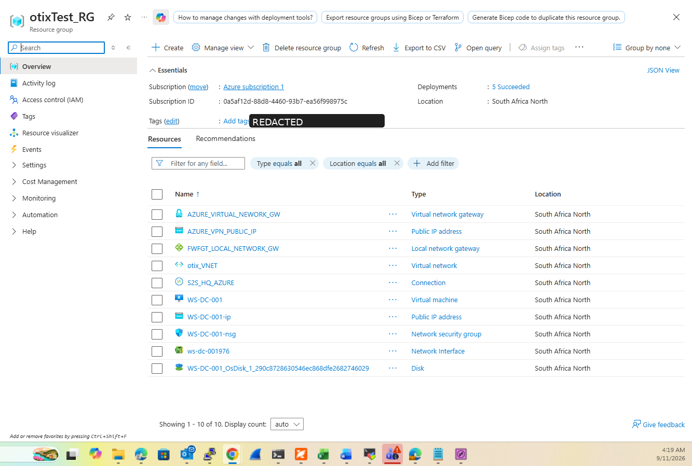

### 2. Azure VNet and subnets
The Azure VNet contains a dedicated `GatewaySubnet` and a separate workload subnet.

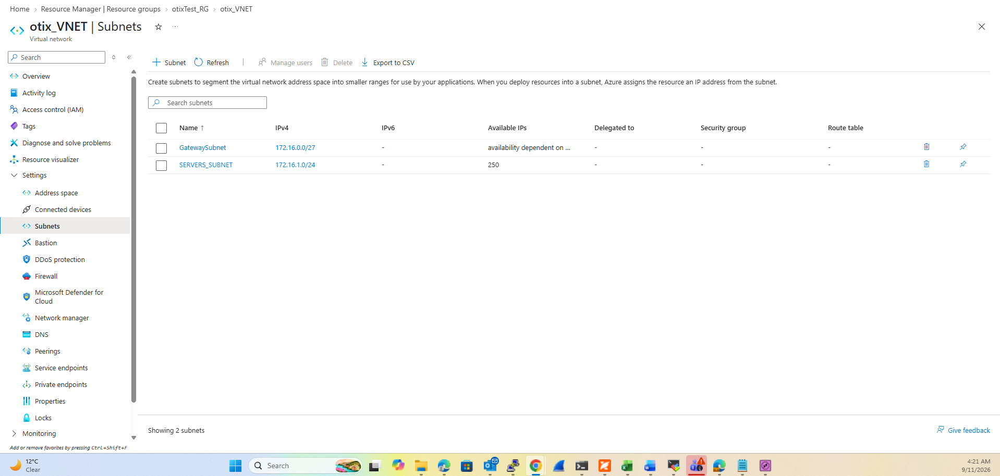

### 3. Azure VPN Gateway
The Azure gateway is a route-based `VpnGw1AZ` gateway attached to the project VNet.

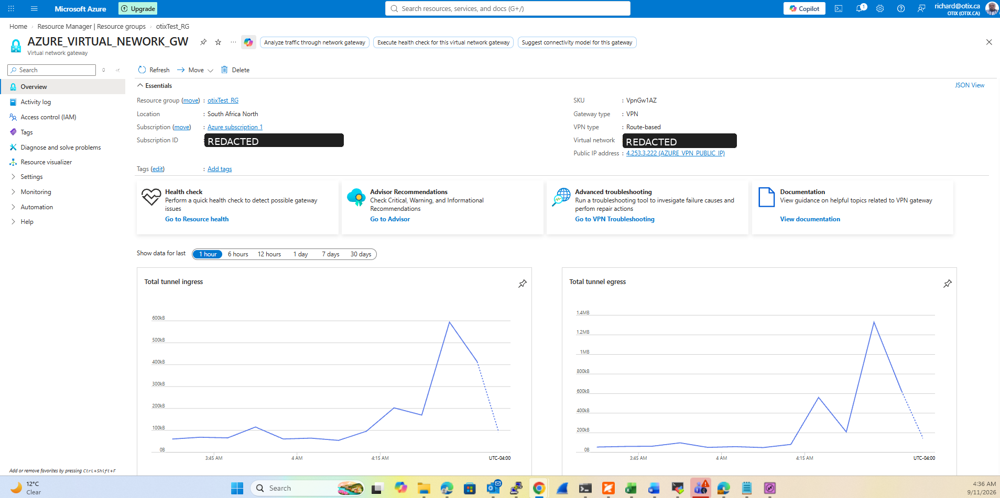

### 4. Local Network Gateway
The Local Network Gateway represents the on-premises side and advertises `192.168.5.0/24` to Azure.

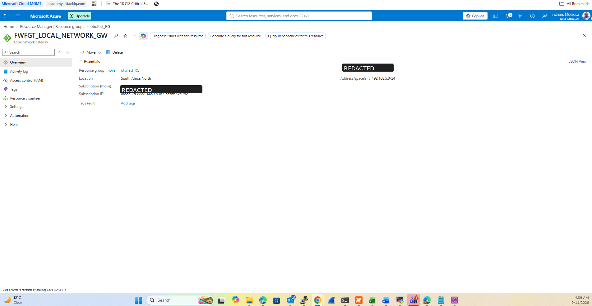

### 5. Site-to-Site connection
The Azure S2S connection is shown as **Connected**, with traffic counters confirming real tunnel usage.

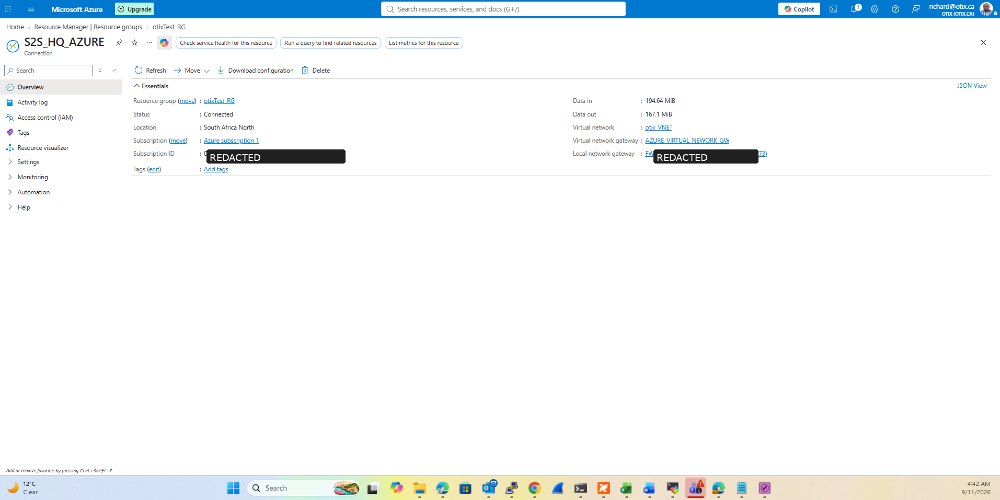

### 6. FortiGate tunnel state
The FortiGate IPsec tunnel is shown **Up** on the on-premises firewall.

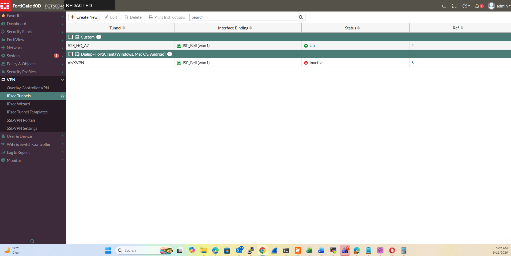

### 7. FortiGate Phase 1
The FortiGate side uses IKEv2 with an IPsec pre-shared-key configuration. The pre-shared key is not exposed.

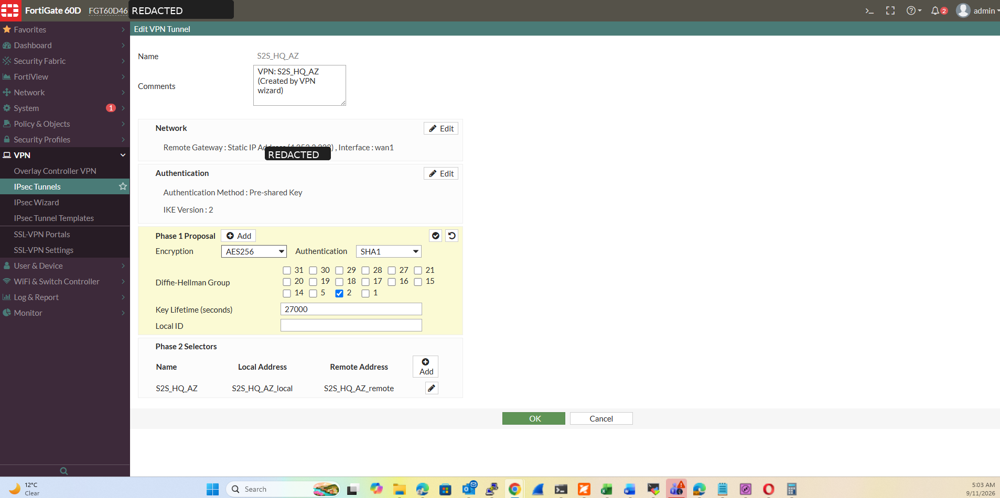

### 8. FortiGate Phase 2
Phase 2 selectors and proposal settings are documented for the lab implementation.

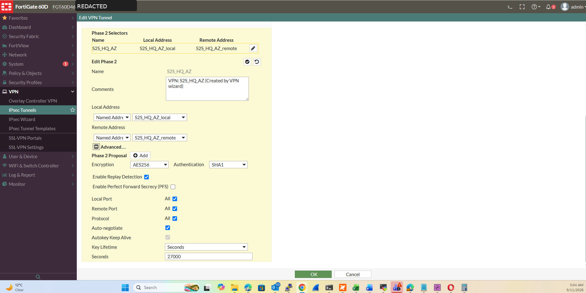

### 9. Connectivity validation
The Azure Windows Server successfully reaches an on-premises host over the private `192.168.5.0/24` network.

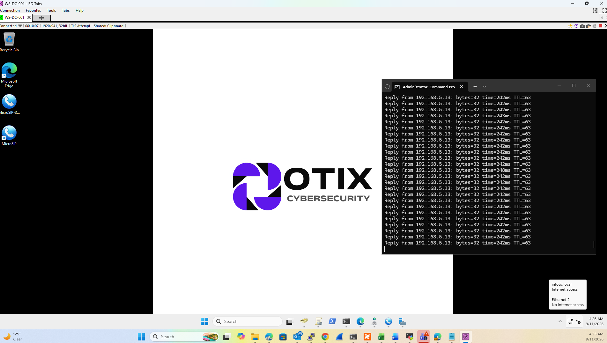

### 10. Application-layer validation
The Azure VM can open an internal on-premises Nginx Proxy Manager page while connected through the S2S path.

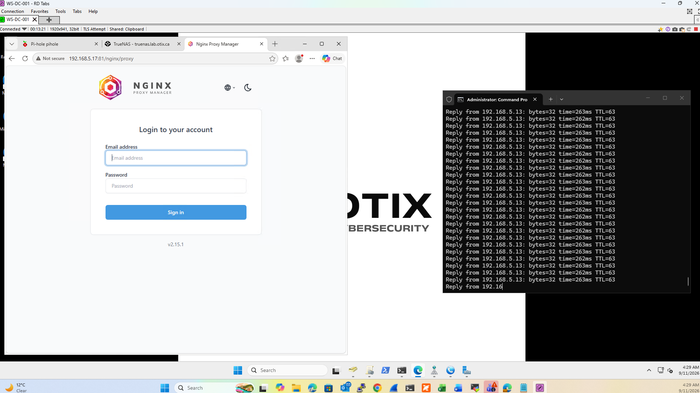

## FortiGate lab parameters observed

The captured lab configuration shows:

- IKEv2
- AES-256 encryption
- SHA-1 authentication
- Diffie-Hellman Group 2 in Phase 1
- 27,000-second key lifetime
- AES-256 / SHA-1 in Phase 2
- Replay detection enabled
- PFS disabled

> **Security note:** SHA-1 and DH Group 2 are legacy choices. They are documented here because they reflect the lab configuration that was implemented. A production deployment should use current vendor guidance and stronger cryptographic suites supported on both peers.

## Traffic flow

```text
Azure workload (172.16.1.0/24)
        ↓
Azure VPN Gateway
        ⇅  IPsec / IKEv2
Internet
        ⇅
FortiGate 60D
        ↓
On-premises LAN (192.168.5.0/24)
```

## What this project demonstrates

- Azure Virtual Network design
- Azure VPN Gateway deployment
- Local Network Gateway configuration
- Route-based Site-to-Site VPN design
- FortiGate IPsec configuration
- Hybrid routing and firewall policy concepts
- Connectivity troubleshooting
- Private service access across a hybrid network
- Cost-awareness for managed cloud networking services

## Lessons learned

The managed `VpnGw1AZ` gateway worked well for the lab and provided a realistic Azure enterprise networking experience, but it represented the majority of the lab's Azure cost. This led to a follow-up cost-optimization exercise evaluating a lower-cost gateway option or a self-managed VPN endpoint for non-production use.

## Repository layout

```text
azure-fortigate-hybrid-s2s-vpn-lab/
├── README.md
├── SECURITY.md
├── assets/
│   ├── architecture/
│   │   ├── hybrid-azure-fortigate-s2s-architecture.png
│   │   └── hybrid-azure-fortigate-s2s-architecture.mmd
│   └── screenshots/
│       ├── 01-azure-resource-inventory.png
│       ├── 02-azure-vnet-subnets.png
│       ├── 03-azure-vpn-gateway-overview.png
│       ├── 04-azure-local-network-gateway.png
│       ├── 05-azure-s2s-connection-connected.png
│       ├── 06-fortigate-ipsec-tunnel-up.png
│       ├── 07-fortigate-phase1-ikev2.png
│       ├── 08-fortigate-phase2-ipsec.png
│       ├── 09-azure-to-onprem-ping.png
│       └── 10-azure-to-onprem-web-access.png
└── docs/
    ├── implementation-notes.md
    └── screenshot-index.md
```
